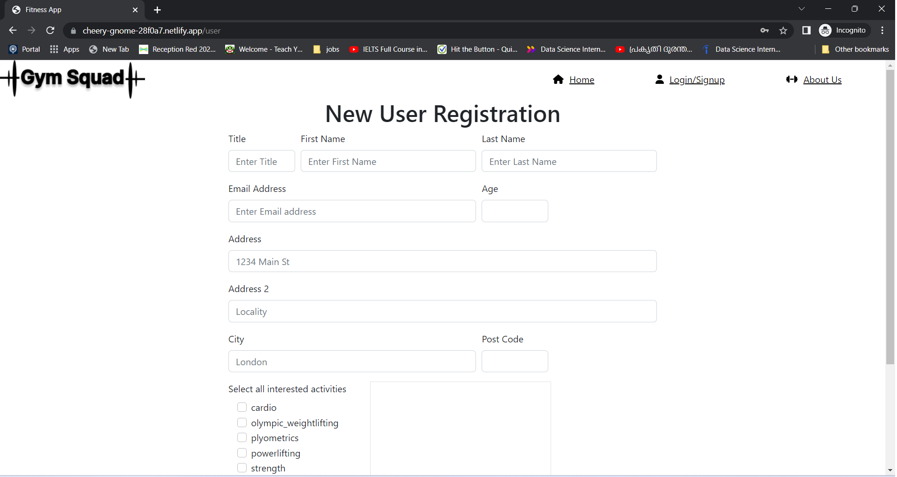

# Gym Squad Fitness Application 
The fitness application is developed to help users acheive their workout and fitness goals. It can be particularly useful for users who are looking to improve their wellness and connect with other fitness enthusiasts and trainers in their neighbourhood

## Screenshots

<h4>Home Page</h4>   

   

<h4>Sign Up Page </h4>  

   

<h4>Login Page </h4>  

   

<h4>Logged in user home page </h4>  

   

<h4>Instructors Page </h4>  

   

<h4>Workout Details Page </h4>  

   

## The application
The application works by allowing users to enter in details on the target areas they are trying to exercise. The application will use a third party API to search for possible work out routines the user can implement to address their workout goals. 
The APIs will compare the targeted areas to be exercised against a database of workout sessions and return suggestions of exercises to be performed and the various equipments for them, allowing users to quickly implement the suggested routines.
Should users be interested, details on workout trainers will also be made available to help advise on any concerns, and user inquiries 

## Deployment Link 

<h4>Deployed application Link :</h4> https://cheery-gnome-28f0a7.netlify.app/   

<h4>Github URL :</h4> https://github.com/umaparu/fitnessclassapp

## Getting Started
To use this application, follow the below steps:
1. Decide what area you will like to exercise 
2. Enter the information on the application form
3. Look through the suggested work out routines recommended by the application
4. Our qualified gym instructors and trainers are at hand to help you design a workout routine targeting any specific concerns you may have 

## Requirements 
- An internet connection is required to use the application and access the third party API 
- A modern web browser is recommended for the best user experience 

## Credits
This fitness app was developed by Charlie, Christiana,Uma, Steva and Rashford. The application used a third party API to search for workout and gym details. Thank you to Rapid API for their valuable contribution to this project. 
